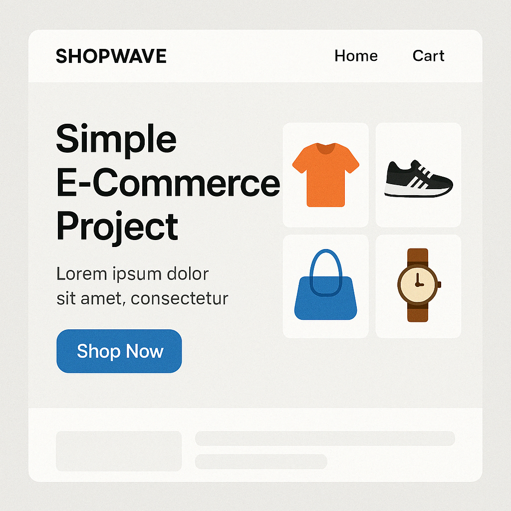

# ShopWave E-Commerce Platform

ShopWave is a modern, full-featured e-commerce platform built with Next.js 15 and connected to a dockerized backend.



## Features

- **Responsive Design**: Fully responsive design that works on all devices
- **User Authentication**: Complete auth flow with login, registration, and password recovery
- **Product Management**: Browse, search, and filter products by categories
- **Shopping Cart**: Add, remove, and manage products in your cart
- **Wishlist**: Save products for later
- **Order Management**: View and track your orders
- **User Profiles**: Manage your account and preferences
- **Dark/Light Mode**: Switch between dark and light themes

## Tech Stack

### Frontend

- **Framework**: Next.js 15
- **Language**: TypeScript
- **Styling**: Tailwind CSS with shadcn/ui components
- **State Management**: React Context API
- **Form Handling**: React Hook Form with Zod validation

### Backend

- **Repository**: [https://github.com/w0nsdoof](https://github.com/w0nsdoof)
- **Deployment**: Docker compose -> ready to go

## Getting Started

### Prerequisites

- Node.js 18+
- PNPM (recommended) or NPM

### Installation

1. Clone the repository:

   ```bash
   git clone [your-repo-url]
   cd ShopWave_FPIS
   ```

2. Install dependencies:

   ```bash
   pnpm install
   # or with npm
   npm install --legacy-peer-deps
   ```

3. Configure environment variables:
   Create a `.env.local` file in the root directory:
   ```
   NEXT_PUBLIC_API_URL=http://localhost:80
   ```
   Replace with your backend URL if different.

### Development

Run the development server:

```bash
pnpm dev
# or
npm run dev
```

Open [http://localhost:3000](http://localhost:3000) in your browser to see the application.

### Production Build

Build for production:

```bash
pnpm build
# or
npm run build
```

Start the production server:

```bash
pnpm start
# or
npm start
```

## Project Structure

```
├── app/                   # Next.js app directory
│   ├── auth/              # Authentication pages
│   ├── cart/              # Shopping cart
│   ├── categories/        # Category browsing
│   ├── orders/            # Order management
│   ├── products/          # Product listings and details
│   ├── profile/           # User profile
│   └── search/            # Search functionality
├── components/            # React components
│   ├── ui/                # UI components (shadcn/ui)
│   └── ...                # Other components
├── contexts/              # React contexts
├── hooks/                 # Custom React hooks
├── lib/                   # Utilities and helpers
│   └── api/               # API interaction functions
├── public/                # Static assets
├── styles/                # Global styles
└── types/                 # TypeScript type definitions
```

## Backend Integration

The ShopWave frontend connects to a dockerized backend API. To connect to your backend:

1. Make sure your backend is running (follow instructions at [https://github.com/w0nsdoof](https://github.com/w0nsdoof))
2. Set the `NEXT_PUBLIC_API_URL` in your `.env.local` file to your backend URL
3. Restart the development server if it's already running

## Contributing

1. Fork the repository
2. Create your feature branch (`git checkout -b feature/amazing-feature`)
3. Commit your changes (`git commit -m 'Add some amazing feature'`)
4. Push to the branch (`git push origin feature/amazing-feature`)
5. Open a Pull Request

## License

This project is licensed under the MIT License - see the LICENSE file for details.

## Contact

- Project Link: [GitHub Repository](https://github.com/your-username/ShopWave_FPIS)
- Backend Repository: [https://github.com/w0nsdoof](https://github.com/w0nsdoof)
